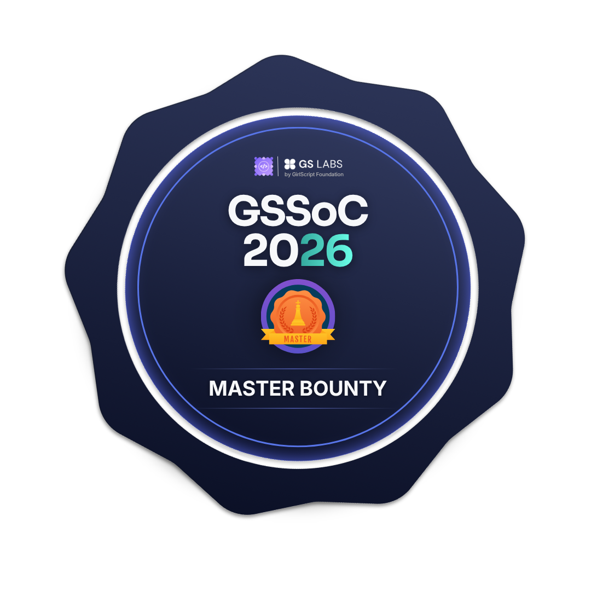

# Krish Sharma 🚀

## 🙋‍♂️ About Me
...

### AI Tools Specialist & Prompt Engineer | Game Developer (Roblox/Python) | Building AI-Driven Web Solutions | Computer Engineering Student @ DSEU

---

- **Experience Summary:** Specializing in AI Tools at DSEU. AI-Powered Web Development (building & selling static/dynamic websites using prompt engineering), Game Development (Leading 7-member team at VS Gaming Studio using Python logic, Roblox Studio, and Unity), and solid foundations from a Diploma in Computer Applications (DCA) including Advanced Excel and digital operations.

---

### 🛠️ Skills & Tools
- **AI & Automation:** Prompt Engineering, AI Tool Integration
- **Web Development:** Static & Dynamic Website Building
- **Game Development:** Python, Roblox Studio, Unity
- **Data & Ops:** Advanced Excel, Digital Operations

## 🛠️ Tech Stack & Tools

## 📊 GitHub Stats

  

## 🐍 My Contribution Snake

  <picture>
    <source media="(prefers-color-scheme: dark)" srcset="https://raw.githubusercontent.com/krishsharma-code/krishsharma-code/output/github-contribution-grid-snake-dark.svg">
    <source media="(prefers-color-scheme: light)" srcset="https://raw.githubusercontent.com/krishsharma-code/krishsharma-code/output/github-contribution-grid-snake.svg">
    
  </picture>

### 🏆 My GitHub Achievements

  
  

## 🏅 GSSoC 2026 Badges

<table>
  <tr>
    <td></td>
    <td></td>
    <td></td>
    <td></td>
  </tr>
  <tr>
    <td></td>
    <td></td>
    <td></td>
    <td></td>
  </tr>
  <tr>
    <td></td>
    <td></td>
    <td></td>
    <td></td>
  </tr>
</table>

## 🤝 Connect with Me

- **LinkedIn:** [krish-sharma07](https://www.linkedin.com/in/krish-sharma07)
- **Email:** [krish.krishsharma9376@gmail.com](mailto:krish.krishsharma9376@gmail.com)
* **Live Website:** [My Termux Hosted Site](https://termuxhub.netlify.app)
---
